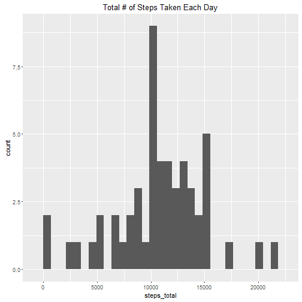
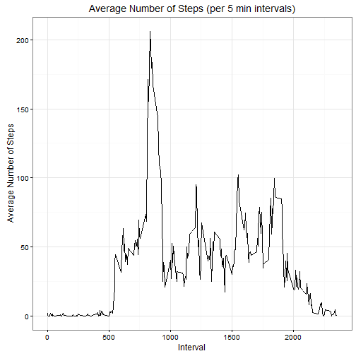
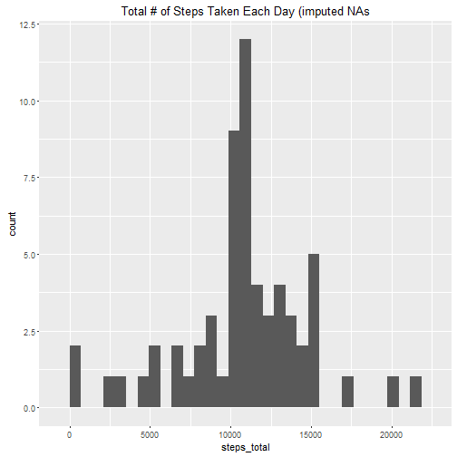
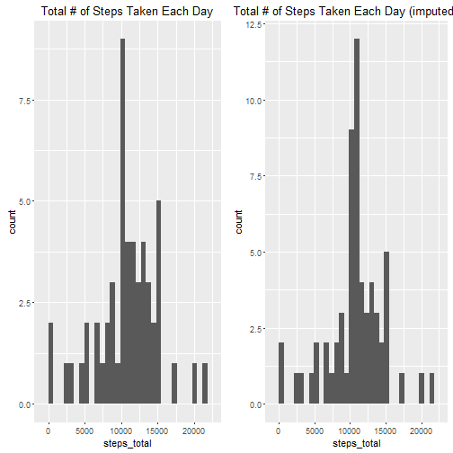
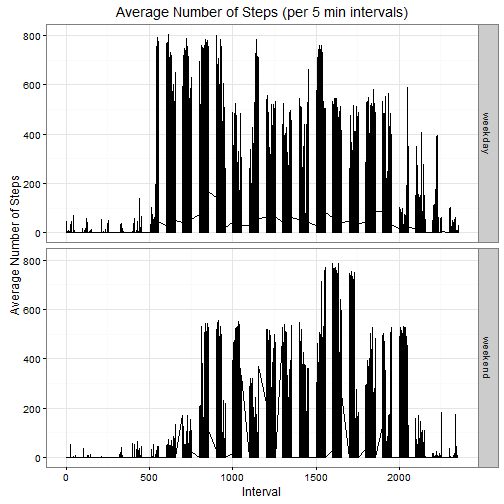

**NOTE**: It is assumed that following packages are installed in R: dplyr, ggplot2, knitr, markdown.

###Loading and preprocessing the data
**1. Load the data**  
**NOTE**: It is assumed that the file repdata%2Fdata%2Factivity.zip is in the current working directory. I downloaded this file on 19/09/2016 from <https://d396qusza40orc.cloudfront.net/repdata%2Fdata%2Factivity.zip>.  

```r
activity <- read.csv(unz("repdata%2Fdata%2Factivity.zip","activity.csv"))
```
**2. Process/transform the data**  

```r
activity$date <- as.Date(activity$date, format = "%Y-%m-%d", tz="GMT")
```
###Mean total number of steps taken per day
**1. Calculate the total number of steps taken per day** 
load dplyr:

```r
library(dplyr)
```
remove all rows with NA values in steps column:

```r
df1 <- filter(activity, steps != "NA")
```
group data frame by date:

```r
grouped_by_date <- group_by(df1, date)
```
total number of steps taken per day:

```r
number_steps <- summarize(grouped_by_date, steps_total = sum(steps))
```
**2. Make a histogram of the total number of steps taken each day**  
load ggplot2 and prepare a histogram:

```r
library(ggplot2)
(hist <- qplot(steps_total, data = number_steps, geom = "histogram", main = "Total # of Steps Taken Each Day"))
```

```
## `stat_bin()` using `bins = 30`. Pick better value with `binwidth`.
```



**3. Calculate and report the mean and median of the total number of steps taken per day**  
mean of the total number of steps taken per day:

```r
(mean_steps <- mean(number_steps$steps_total))
```

```
## [1] 10766.19
```
median of the total number of steps taken per day:

```r
(median_steps <- median(number_steps$steps_total))
```

```
## [1] 10765
```
###Average daily activity pattern
**1. Make a time series plot (i.e. type = "l") of the 5-minute interval (x-axis) and the average number of steps taken, averaged across all days (y-axis)**  
find average number of steps for each interval:

```r
grouped_by_interval <- group_by(df1, interval)
mean_steps_interval <- summarize(grouped_by_interval, steps_mean = mean(steps))
```
prepare a time series plot:

```r
ggplot(mean_steps_interval, aes(x=interval, y=steps_mean, group = 1)) +   
    labs(title="Average Number of Steps (per 5 min intervals)", x="Interval", y="Average Number of Steps")+
    geom_line()+
    theme_bw()
```



**2. Which 5-minute interval, on average across all the days in the dataset, contains the maximum number of steps?**  

```r
(max_interval <- select(filter(mean_steps_interval, steps_mean == max(mean_steps_interval$steps_mean)), interval))
```

```
## Source: local data frame [1 x 1]
## 
##   interval
##      (int)
## 1      835
```

###Impute missing values
**1. Calculate and report the total number of missing values in the dataset (i.e. the total number of rows with NAs)**  

```r
(activity_na <- sum(is.na(activity)))
```

```
## [1] 2304
```
**2. Devise a strategy for filling in all of the missing values in the dataset.**  
For each missing observation I use the mean for that 5-minute interval. 
**3. Create a new dataset that is equal to the original dataset but with the missing data filled in.
Make a histogram of the total number of steps taken each day and Calculate and report the mean and median total number of steps taken per day. Do these values differ from the estimates from the first part of the assignment? What is the impact of imputing missing data on the estimates of the total daily number of steps?**  
create data frame "imputed_activity" in which all NAs will be imputed:

```r
imputed_activity <- activity
```
The algorithm written below:
* finds NA in step column of primary data table "activity", 
* looks up mean for that interval (in "mean_steps_interval" table)
* replaces NA with mean for that 5-minute interval values.

```r
n_of_observations <- length(imputed_activity$steps)
for (i in 1:n_of_observations) {
  if (is.na(imputed_activity[i, 1])) {target_interval <- imputed_activity[i,3]
                            target_int_mean <- filter(mean_steps_interval, interval ==  target_interval)
                            imputed_activity[i,1] <-target_int_mean$steps_mean} else {imputed_activity[i,1]=imputed_activity[i,1]}
  }
```
Make a histogram of the total number of steps taken each day and Calculate and report the mean and median total. 
group by date:

```r
grouped_by_date_imputed <- group_by(imputed_activity, date)
```
total number of steps taken per day:

```r
number_steps_imputed <- summarize(grouped_by_date_imputed, steps_total = sum(steps))
```
histogram of the total number of steps taken each day:

```r
(hist_imp <- qplot(steps_total, data = number_steps_imputed, geom = "histogram", main = "Total # of Steps Taken Each Day (data with imputed NAs"))
```

```
## `stat_bin()` using `bins = 30`. Pick better value with `binwidth`.
```


mean and median of the total number of steps taken per day:

```r
(mean_steps_imputed <- mean(number_steps_imputed$steps_total))
```

```
## [1] 10766.19
```

```r
(median_steps_imputed <- median(number_steps_imputed$steps_total))
```

```
## [1] 10766.19
```
Do these values differ from the estimates from the first part of the assignment? 
The mean before imputing equals mean after imputing:

```r
identical((mean_steps_diff <- mean_steps_imputed - mean_steps),0)
```

```
## [1] TRUE
```
The median after imputing is slightly higher the one before imputing:

```r
(median_steps_imputed <- median_steps_imputed - median_steps)
```

```
## [1] 1.188679
```
What is the impact of imputing missing data on the estimates of the total daily number of steps?

```r
library(grid) 
library(gridExtra)
grid.arrange(hist, hist_imp, ncol = 2)
```

```
## `stat_bin()` using `bins = 30`. Pick better value with `binwidth`.
## `stat_bin()` using `bins = 30`. Pick better value with `binwidth`.
```


Comparing 2 histograms, we see that the peak value (with the maximum number of observations i.e. most frequent) of steps per day is slightly higher than it is in dataset w/o imputing. These changes don't influence significantly on the median value and have no influence on mean value.


###Differences in activity patterns between weekdays and weekends
**1. Create a new factor variable in the dataset with two levels – “weekday” and “weekend” indicating whether a given date is a weekday or weekend day.** 

```r
Sys.setlocale("LC_TIME", "English")
```

```
## [1] "English_United States.1252"
```

```r
imputed_activity$wd <- weekdays(imputed_activity$date)
n_of_observations <- length(imputed_activity$wd)
for (i in 1:n_of_observations) {
  if (imputed_activity$wd[i]=="Sunday") {imputed_activity$wday_or_wend[i] <- "weekend"}  else if (imputed_activity$wd[i]=="Saturday") {imputed_activity$wday_or_wend[i] <- "weekend"} 
  else {imputed_activity$wday_or_wend[i] <- "weekday"}}
```
convert values from column wday_or_wend into factor variables

```r
imputed_activity$wday_or_wend <- as.factor(imputed_activity$wday_or_wend)
```
remove column wd (contains weekday names)

```r
imputed_activity <- select(imputed_activity, -wd)
```
**2. Make a panel plot containing a time series plot of the 5-minute interval (x-axis) and the average number of steps taken, averaged across all weekday days or weekend days (y-axis).**  
group by weekend/weekday and 5-minutes interval

```r
grouped_imputed_activity <- group_by_(imputed_activity , .dots=c("wday_or_wend", "interval"))
for_we_wd_plots <- summarize(grouped_imputed_activity, steps=mean(steps))
```
create two plots:

```r
ggplot(grouped_imputed_activity, aes(x=interval, y=steps, group = 1)) +   
  labs(title="Average Number of Steps (per 5 min intervals)",x="Interval", y="Average Number of Steps")+
  geom_line()+
  theme_bw()+
  facet_grid(wday_or_wend ~ .)
```


create PA1_template.md and PA1_template.html. I intentionally didn't format following code as a code. There is no need to execute it each time someone knit HTML. However, to prepare the assignment please 
add following lines to R console.
if(!file.exists("PA1_template.md")){
  require(knitr)
  knit("PA1_template.Rmd", "PA1_template.md")
} else {
  print("PA1_template.md already exists in your working directory")
}

if(!file.exists("PA1_template.html")){
  require(markdown)
  markdownToHTML("PA1_template.md", "PA1_template.html")
} else {
  print("PA1_template.html already exists in your working directory")
}
